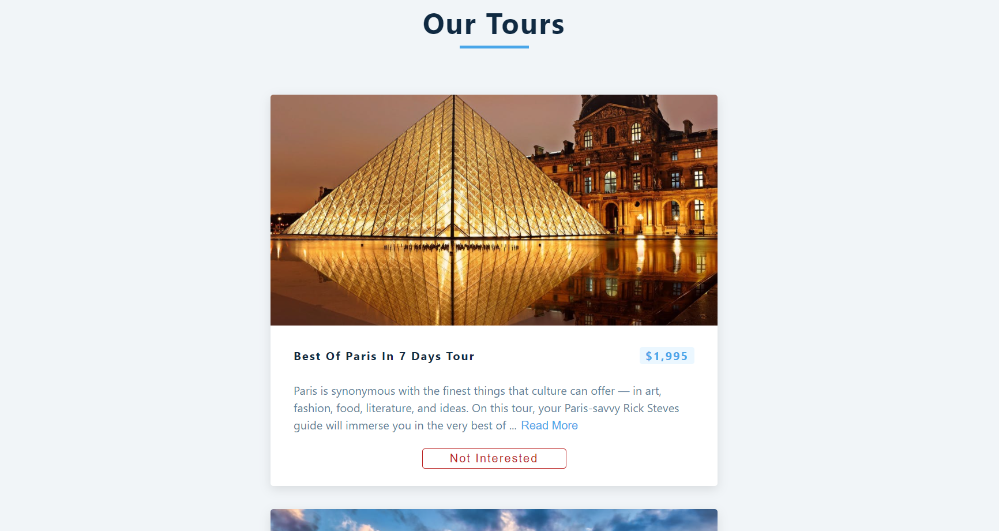
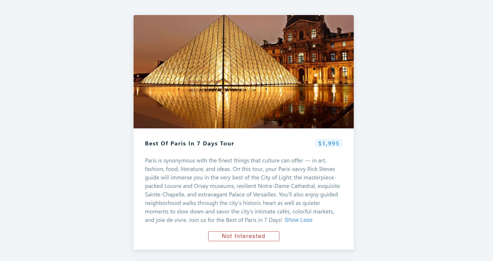
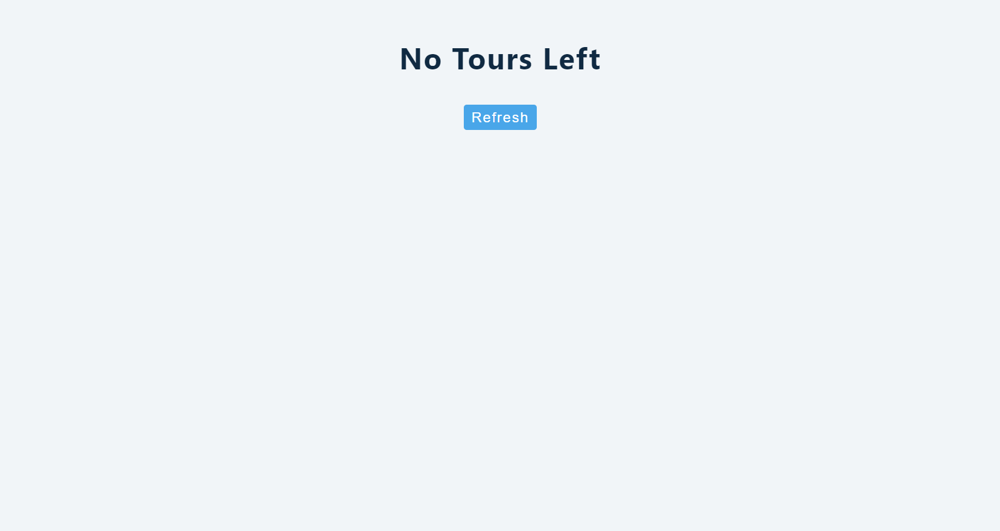

# Tours React App

<!--  -->

---
## Description
- Data is taken from an api [https://course-api.com/react-tours-project](https://course-api.com/react-tours-project).
- This api consists of image, id, name, info and price for each tour in json format.
- Button "Read more" shows complete info and "Show less" hides the info upto 200 words.
- A button "Not Intersted" will remove that tour from user's list.
- When all the tours are removed, "Refresh" button will help user to regain back all the removed tours to page. 

---